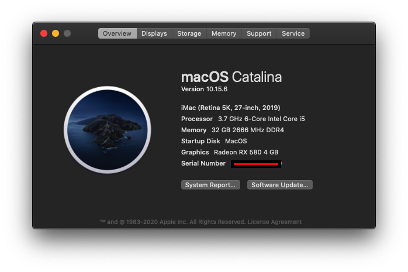

# Hackintosh Opencore 0.6.0 Installation Guide for Gigabyte Z390 Aorus Pro WiFi - Catalina(>=10.15.6)  and BigSur(Beta5)

### This guide is not intended for beginner, you have been warned. No support is provided unless there is a valid issue. Please read everything before starting

### Hardware

Type|Item
:----|:----
**CPU** | [Intel - Core i5-9600K]
**Motherboard** | [Gigabyte - Z390 AORUS PRO WiFi]
**Memory** | [Corsair vengeance 32GB]
**Storage (macOS)** | [Samsung EVO 970 Plus 500GB]
**Storage (Windows)** | [Samsung EVO 970 Plus 250GB]
**Video Card** | [SAPPHIRE PULSE RX 580 4GB]
**WiFi + Bluetooth** | [BCM943602CS2]

### Prerequisite 
Please understand all OpenCore configuration by reading [Configuration.pdf](https://github.com/acidanthera/OpenCorePkg/blob/0.5.9/Docs/Configuration.pdf) 

### Required Tools
- [GenSMBIOS](https://github.com/corpnewt/GenSMBIOS)
- [EFI-Agent](https://github.com/headkaze/EFI-Agent)
- [Hackintool](https://github.com/headkaze/Hackintool)

### Extras
1. [BCM943602CS2 WIN10 BT/WiFi Driver](https://mega.nz/file/h5ozUZCS#XVszB3yWDcyhaNxahbMWJLiEmnmGpqbuAnahyGDdv7Y)

### What's Working/What's Not

##### Working
- Ethernet
- Onboard Audio
- HDMI Audio
- DP Audio
- IGPU in headless mode
- App Store
- Wake/Sleep
- Restart
- Shutdown
- USB (Correct SS/HS speed)
- All DP and HDMI port
- Dual monitor from boot
- Apple Music (iTunes)
- iMessage
- Facetime
- Handoff
- Airdrop
- Continuity
- AirPlay
- Intel Bluetooth. (Disable Broadcom  BCM943602CS2 USB Port)

##### Not Tested
- FileVault
- Power Nap
